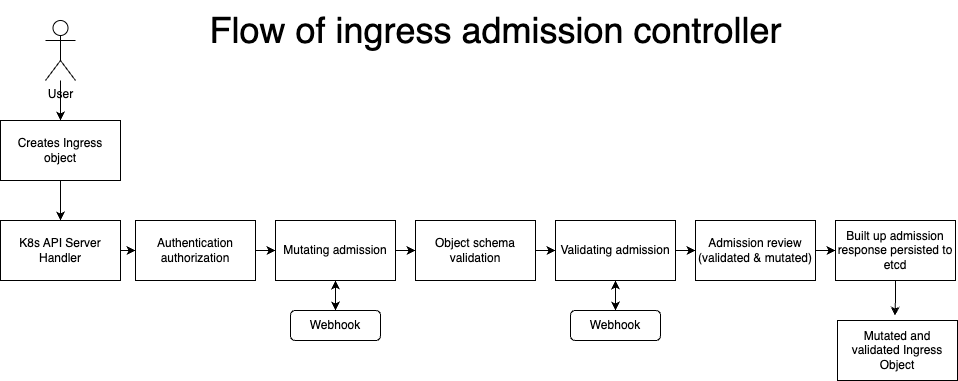

# OpenShift Admission Controller for Ingress Objects

This repository contains an OpenShift Admission Controller specifically designed for handling Ingress objects. The admission controller intercepts requests to create and update Ingress resources and applies custom validation and mutation logic before allowing or rejecting the request.

## Introduction

OpenShift Admission Controllers provide a way to enforce policy and validation rules on resources created within an OpenShift cluster. This admission controller focuses on Ingress objects, which are used to configure external access to services within the cluster.

The admission controller is built and deployed through two webhook configurations. It runs as a separate service and deployment which intercepts requests made to the OpenShift API server related to Ingress resources. By intercepting these requests, the admission controller can modify or validate the Ingress objects before they are persisted to the cluster.

## Features

- Host name and common name are mutated so they follow this naming convention: Service-Namespace.apps.ClusterBaseDomain
- Annotations are mutated to reflect the environment variables set in deployment of server which are set up to point to the CAS issuer and cert-manager (These can be changed through changing environment variables within deployment to reflect the specific needs of the cluster)
- User must include Annotations and choose which termination type they want: edge or passthrough
- Services within the namespace retrieved are checked against the Ingress object to ensure user is attaching the ingress to an existing running service
- Further validation occurs in the form of checking for spec such as tls, hosts and secretName fields and values exist

Once the mutated and validated ingress object has the necessary annotations, cert-manager then picks this up and creates a CSR. This then points to the correct Google CAS issuer pool which returns a signed issued certificate in the form of a secret. This secret which has already been specified in the ingress object is then used to attach itself to the newly created route from the ingress and encrypt the route.

INSTRUCTION ON HOW TO DEPLOY:

oc apply -f configs/ (run twice)
oc new-build --name admission-controller-ingress --binary=true --strategy=docker -n admission-namespace
oc start-build admission-controller-ingress --from-dir=. --follow -n admission-namespace# cert-admission-ctrl

